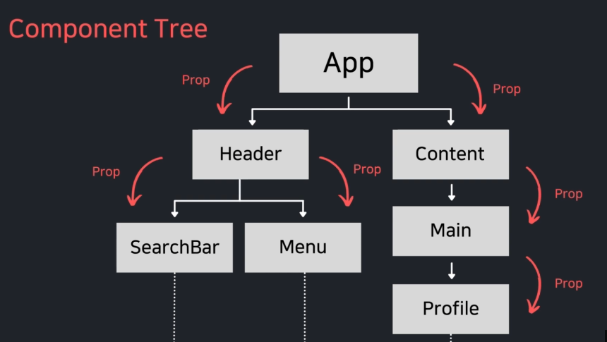
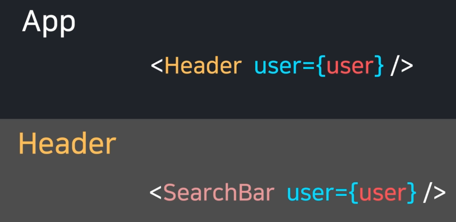
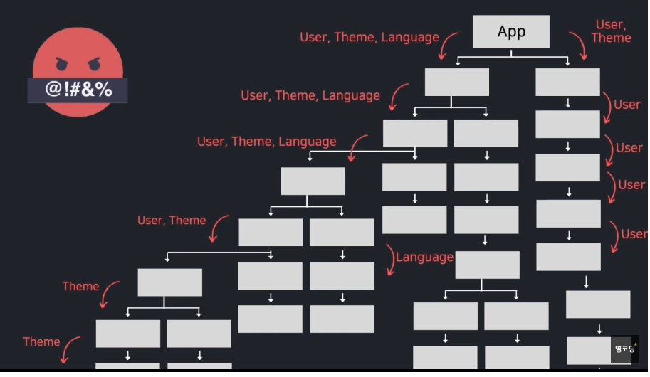
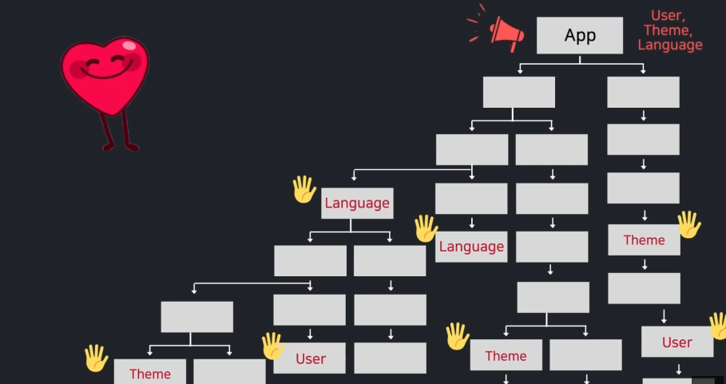
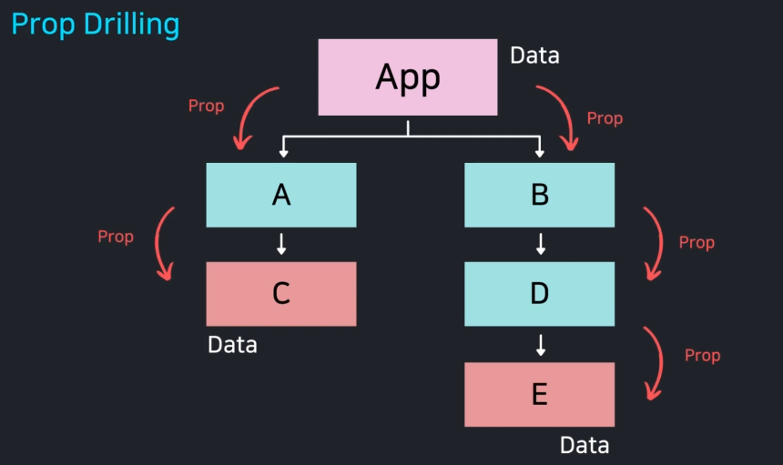
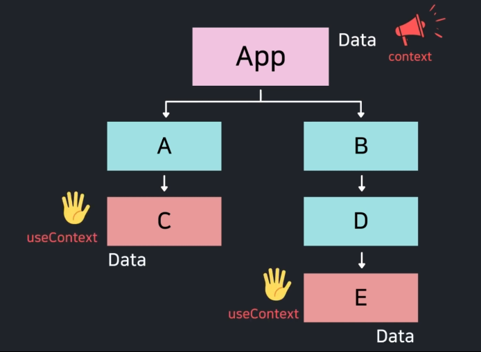
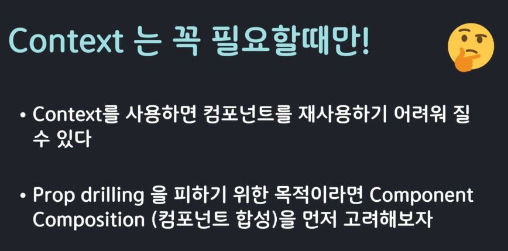

## useContext + Context API

---

- 보통 부모 컴포넌트에서 자식 컴포넌트로 props를 전달한다.

- props를 작성해 넘긴다.

- 만일 컴포넌트가 위와 같이 많다면 일일이 단계별로 전달해야한다면 코드도 복잡해지고 뭔가 하나 바뀐다면 일일이 찾아다녀야하는 문제가 있다.

- 이러한 문제를 해결하기위해 리액트에서는 Context API 를 제공한다.
- props를 가지고 있지 않아도 상위 컴포넌트에서 방송을 해주면 하위 컴포넌트들은 어디에 있던 상관없이 전역적인 데이터를 전달 받을 수 있다.

- C, E의 경우에는 A, B, D를 일일이 거쳐 props 를 전달받아야 한다.
- 이런 과정을 Prop Drilling이라고도 한다.
- 데이터가 이렇게 모든 중간 컴포넌트를 거쳐가야 한다는 비효율적인 상황(코드가 더러워지고 중간에 데이터가 변질될 가능성 등)을 해결하기위해 Context를 사용한다.

- 데이터가 필요한 측에서 useContext를 사용해서 해결할 수 있다.

- Context를 사용하면 컴포넌트를 재사용하기 어려워질 수 있기때문에 필요한 경우에만 사용하는 것을 추천한다.
- 리액트 Docs에서는 단순히 Prop Drilling을 피하기 위한 목적이라면 컴포넌트 합성을 먼저 고려해야 한다.
