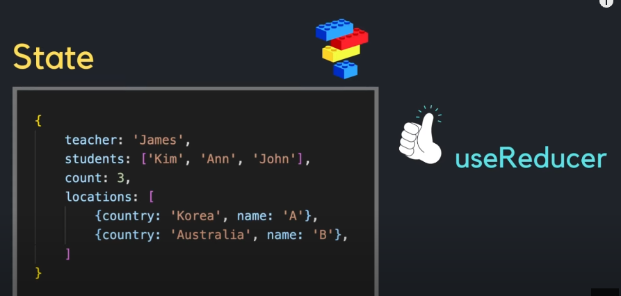
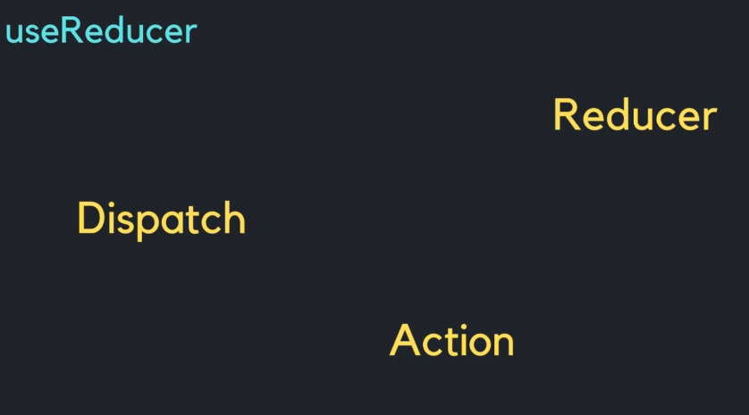
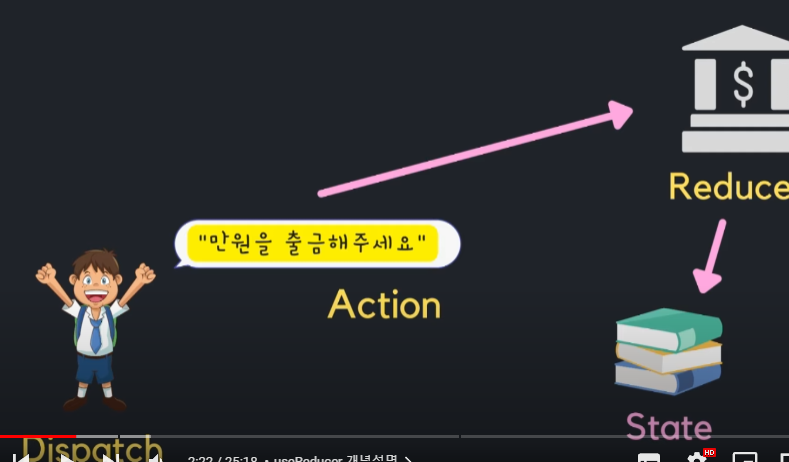
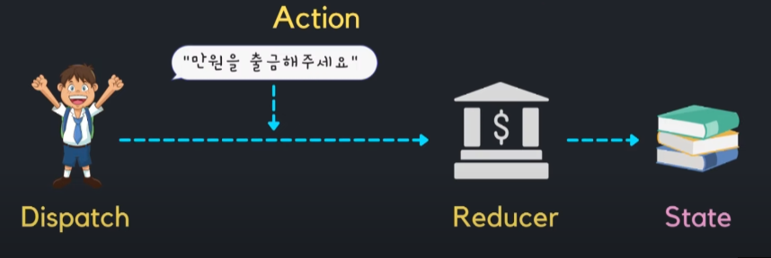
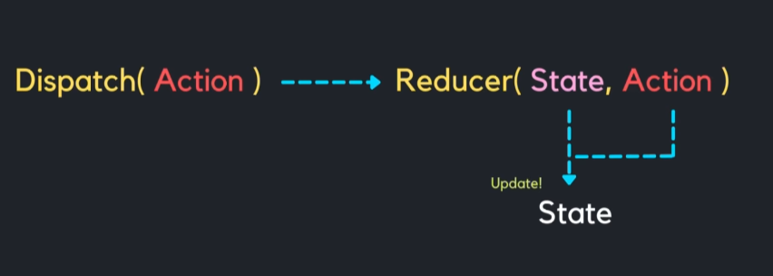

## useReducer

---

- 컴포넌트에 state를 생성하고 관리할 때 있어 기존에는 useState를 사용해왔다.
- 하지만 React에서 state 관리를 위한 또 다른 훅인 `useReducer`가 존재한다.
- `useReducer`는 `useState`처럼 state를 생성하고 관리하는 도구이다.

 

### 사용 시기

- 여러개의 하위 값을 포함하는 복잡한 state를 다뤄야할때 useState대신 useReducer를 사용하면 코드를 훨씬 깔끔하게 사용할 수 있고 유지보수도 한결 깔끔해진다.

 

### 알아둬야할 점

- `useReducer`는 `Reducer`, `Dispatch`, `Action`으로 이루어져 있다.

- 예를 들어 철수가 은행에 방문했다고 했을때 은행에서 만원을 출금해달라고 요구하면 철수의 계좌 거래내역에서 만원이 빠져나갔다고 기록이 된다. 여기서 중요한건 철수가 직접적으로 자신의 거래내역을 업데이트 시키지 않는다. 거래내역을 업데이트 시키는 것은 철수대신 은행이 진행해준다.
- 철수는 요구만 하고 은행이 업데이트 시켜준다. => 이 느낌이 가장 중요하다.
- 여기서 거래 내역을 State라고 하고 철수의 요구대로 업데이트 시켜주는 은행은 Reducer 라고 할 수 있다. Reducer는 state를 업데이트 해주는 역할을 한다. 컴포넌트의 state를 변경하고 싶다면 꼭 Reducer를 이용해서 해야한다. 철수는 거래내역이라는 state를 변경하기 위해 요구라는 것을 했다. 이러한 요구라는 행위를 Dispatch라고 할 수 있다. 또한 그러한 요구에는 `만원을 출금해주세요`라는 내용이 있는데 이러한 내용을 Action이라고 한다.
- 철수는 은행에게 요구라는 Dispatch안에 내용이라는 Action을 담아 은행이라는 Reducer에 보냄으로써 state를 변경할 수 있는 것이다.

- 다시한번 정리해보자면 철수가 거래내역이라는 state를 업데이트 하기 위해선 요구라는 dispatch에 만원을 출금해주세요라는 내용인 Action을 넣어서 은행이라는 Reducer에 전달해줘야한다.
- 그러면 은행은 Action의 내용대로 state를 업데이트 시켜준다.
- 철수는 은행이라는 Reducer에 다른 Action을 보내줌으로써 예금, 출금 등 복잡한 작업을 할 수 있다.

- 이것을 컴포넌트 관점에서 보자면 우리의 state를 업데이트 시켜주기 위해서는 Dispatch라는 함수의 인자로 Action이라는 것을 넣어서 Reducer에 전달해주는 것이다.
- 그러면 Reducer가 컴포넌트의 state를 우리의 Action안에 들어가 있는 내용대로 업데이트 시켜주는 것이다.

---
