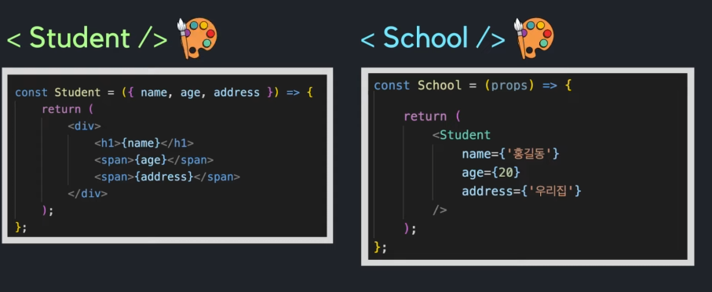
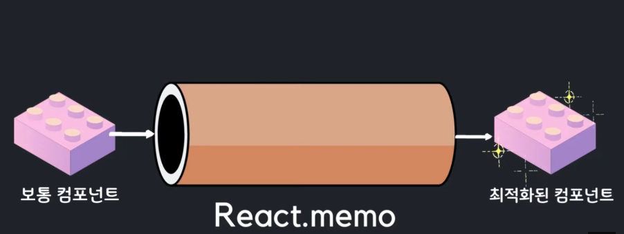
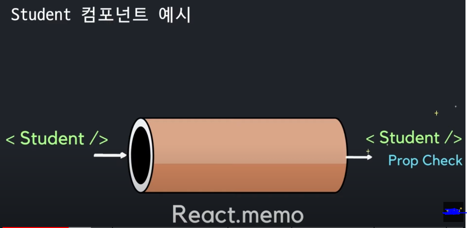
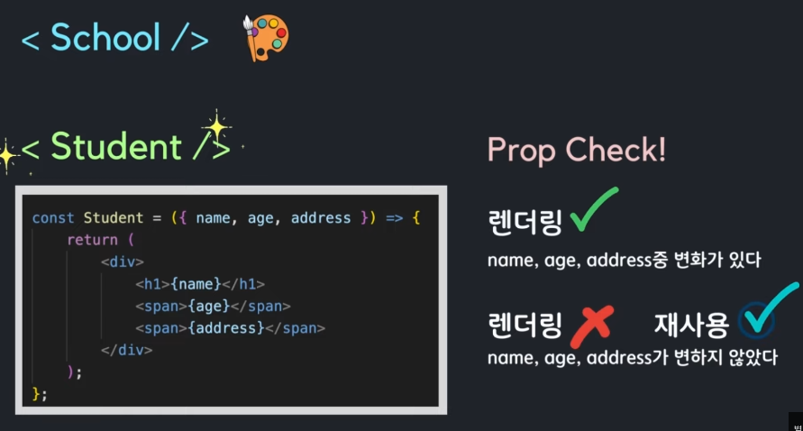
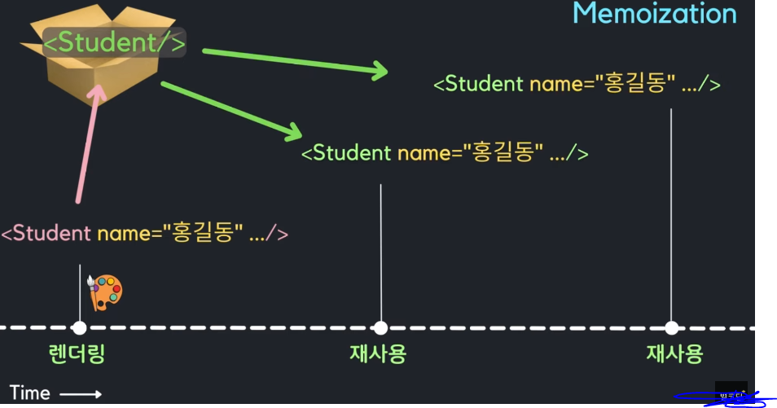
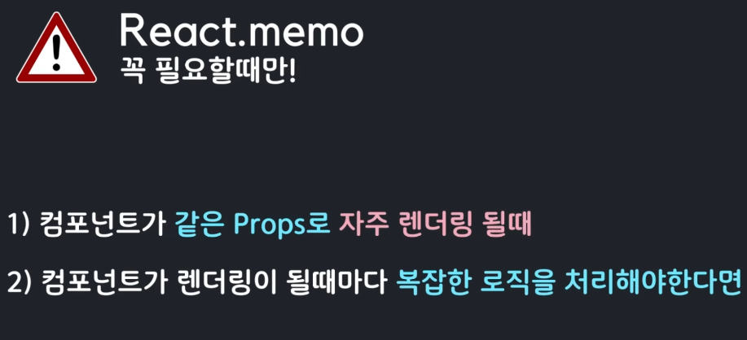

## Custom Hooks

---

- 불필요한 컴포넌트 렌더링이 발생할 때가 있다.
- 또한 그러한 컴포넌트가 복잡한 작업을 한다면 프로그램이 무거워 질 수 있다.

- `React.memo`와 `useMemo`, `useCallback`을 이용해 이를 해결할 수 있다.

- 사실 리액트는 성능이 좋은편이기 때문에 컴포넌트의 렌더링을 크게 고민할 필요가 많이 없다.

- 하지만 렌더링이 지나치게 많이 발생하거나 성능에 부담을 준다면 그러한 렌더링 성능을 개선해야 한다.

- 위와 같은 컴포넌트가 있을때 부모컴포넌트(School)가 렌더링되면 모든 자식컴포넌트들도 함께 렌더링 된다.
- Student의 경우 props가 고정되어있기 떄문에 렌더링되어도 같은 결과를 나타낼 것이다.
- 만일 student가 무거운 데이터를 가져오고 계속해서 렌더링 된다면 성능이 많이 안좋아질 것이다.
- 그렇기에 props가 업데이트 될 때에만 렌더링하고 싶다면 이럴때 `React.memo`를 사용할 수 있다.

- `React.memo`는 리액트에서 제공하는 `고차 컴포넌트`이다.
- `고차 컴포넌트(HOC)`란 ?
  - 어떤 컴포넌트를 인자로 받아 새로운 컴포넌트를 반환해주는 함수이다.
  - `React.memo`라는 고차 컴포넌트에 어떤 컴포넌트를 넣어주면 UI 적으로나 기능적으로는 똑같지만 좀 더 최적화된 컴포넌트를 반환해준다.
- 이렇게 최적화가 된 컴포넌트는 렌더링이 되어야 할 상황에 놓일떄마다 `prop check`를 통해서 자신이 받는 props에 변화가 있는지 없는지 확인을 하게 된다.
- 이렇게 확인을 해서 props에 변화가 있다면 렌더링을 하고 props에 변화가 없다면 새로 렌더링을 하는게 아니라 기존에 이미 렌더링이 된 내용을 재사용한다.

- 부모인 school 컴포넌트가 렌더링이 될 때마다 자녀인 student 컴포넌트도 자동적으로 렌더링 된다.
- 이때 student 컴포넌트가 React.memo에 의해 최적화가 되어 있다면 이상황에서 리액트는 Prop Check를 하게 된다.
- Student 컴포넌트가 받는 name, age, address에 변화가 있다면 렌더링을 발생시키고, 그렇지 않은 경우에는 새로 렌더링을 하는게 아니라 `이전에 이미 렌더링된 결과를 재사용`하는 최적화된 컴포넌트가 된다.

- React.memo의 memo는 Memoization을 뜻한다.
- Memoization이란 이미 계산해 놓은 값을 메모리 상에 저장해놓고 필요할때마다 꺼내서 재사용하는 기법이다.

- 우리가 이미 이전에 렌더링을 해놓은 Student 컴포넌트를 메모리 어딘가에 저장해놓고 새로 렌더링하는 대신 꺼내서 재사용하는 것이 React.memo의 Memoizaion 기법이다.

- React.memo 를 잘 사용한다면 렌더링 횟수 감소로 인해 이득을 많이 볼 수 있지만 무분별하게 사용한다면 성능에 독이 될 수 있다.
- 왜냐하면 컴포넌트를 메모이징 할 때 렌더링된 결과를 어딘가에 저장해야하기 때문에 메모리를 추가적으로 소비하기 때문이다.

- 한가지 기억해야 하는 점은 React.memo 는 prop check를 통해서만 렌더링 유무를 판단한다.
- 만일 컴포넌트가 useState, useReducer, useContext 를 사용한다면 props에 변화가 없더라도 여전히 state나 context가 변할때마다 다시 렌더링 될 것이라는 것은 기억해야한다.

---
